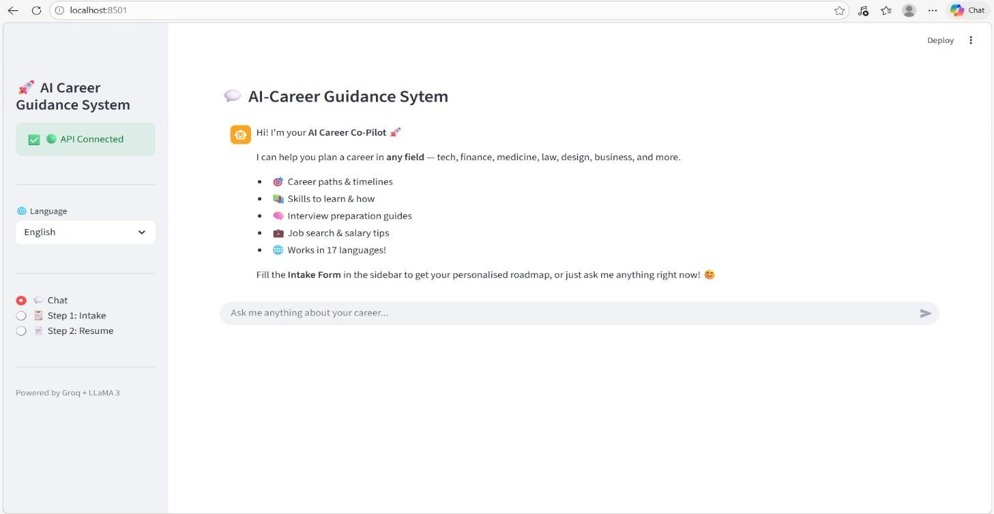
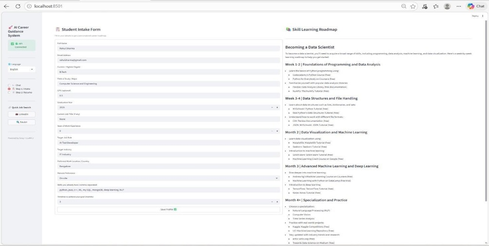
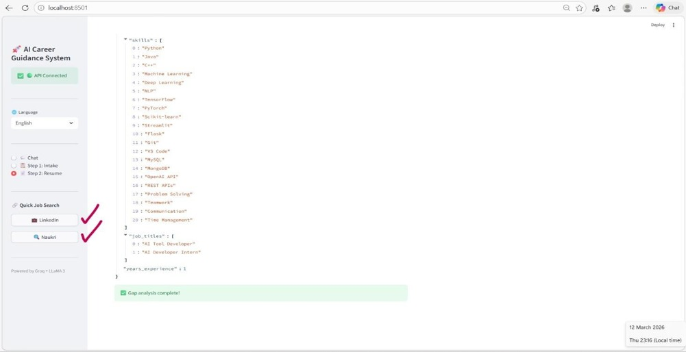
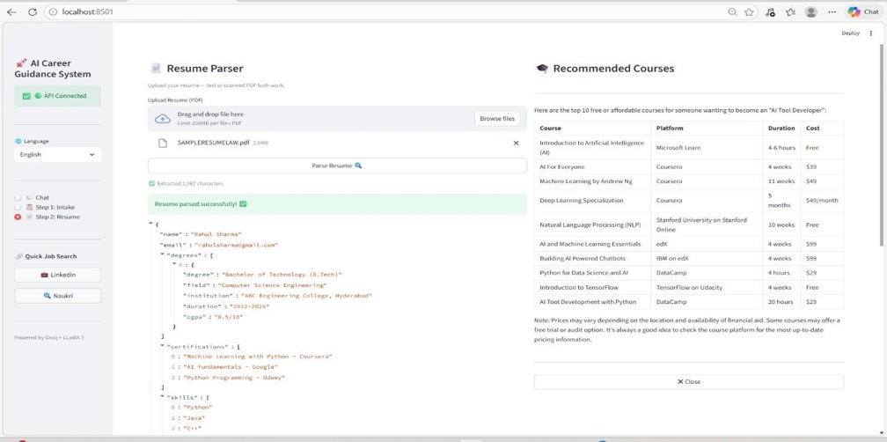
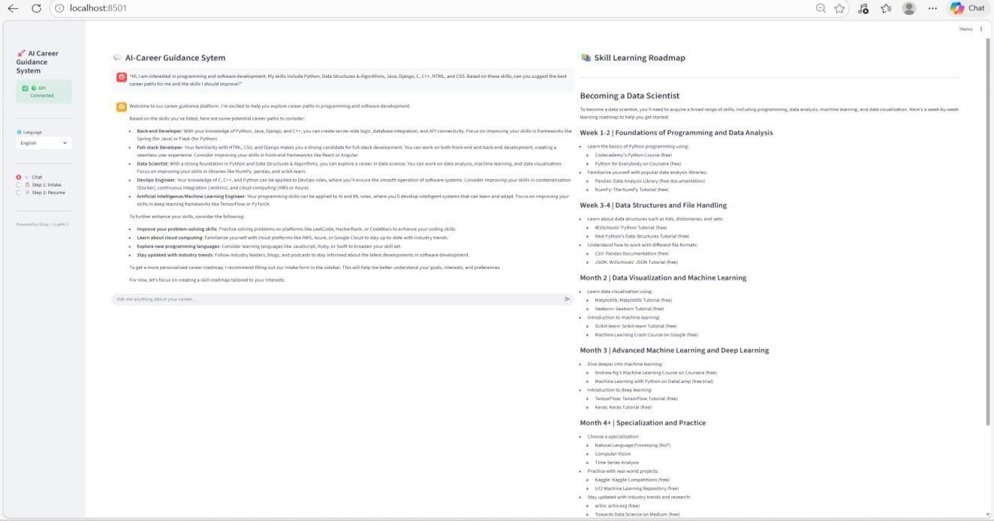

<div align="center">

# 🎯 AI Career Guidance System

### AI Career Co-Pilot and Career Guidance Chatbot

An intelligent career guidance platform that analyses resumes, identifies skills, recommends suitable career paths, highlights skill gaps, generates personalised career roadmaps, and provides chatbot-based career support.


</div>

---

## 📌 Project Overview

Choosing the right career path can be difficult for students and job seekers because they may not clearly understand their existing skills, missing skills, or suitable job roles.

The **AI Career Guidance System** helps users make informed career decisions by analysing their resumes and providing personalised career recommendations.

The system combines resume parsing, skill extraction, job-market data, artificial intelligence, OCR, and conversational guidance to generate useful career insights.

---

## ✨ Key Features

* 📄 Upload and analyse resumes
* 🔍 Extract skills from PDF resumes
* 🖼️ OCR support for scanned resumes
* 🎯 Recommend suitable career roles
* 📊 Compare user skills with job-role requirements
* ⚠️ Identify missing skills and skill gaps
* 🗺️ Generate personalised career roadmaps
* 💬 Provide AI-powered career guidance through a chatbot
* 📈 Use job-market data for career insights
* 📑 Generate career roadmap reports
* ⚡ FastAPI-based backend
* 🖥️ Interactive Streamlit user interface

---

## 🧠 How the System Works

1. The user uploads a resume through the Streamlit interface.
2. The system extracts text from the resume.
3. OCR is used when the uploaded PDF contains scanned images.
4. Skills, experience, education, and other relevant information are identified.
5. The extracted profile is compared with available career-role data.
6. Suitable career roles are recommended.
7. Missing skills are identified through skill-gap analysis.
8. A personalised learning and career roadmap is generated.
9. The user can ask additional career-related questions through the AI chatbot.

---

## 🏗️ System Architecture

```text
User
  │
  ▼
Streamlit Frontend
  │
  ▼
FastAPI Backend
  │
  ├── Resume Parser
  ├── OCR Processing
  ├── Skill Extraction
  ├── Career Recommendation
  ├── Skill-Gap Analysis
  ├── Career Roadmap Generator
  └── AI Career Chatbot
          │
          ▼
      Groq AI Model
          │
          ▼
 Career Recommendations
 Skill-Gap Results
 Personalised Roadmap
 Chatbot Responses
```

---

## 🛠️ Technologies Used

| Technology  | Purpose                                       |
| ----------- | --------------------------------------------- |
| Python      | Core programming language                     |
| Streamlit   | Interactive frontend interface                |
| FastAPI     | Backend API development                       |
| Uvicorn     | FastAPI application server                    |
| Groq API    | AI-powered career recommendations and chatbot |
| PyMuPDF     | Extracting text from PDF resumes              |
| Pytesseract | OCR for scanned resumes                       |
| Pillow      | Image processing                              |
| Pandas      | Dataset processing and analysis               |
| Requests    | Communication between frontend and backend    |
| Pydantic    | API request and response validation           |

---

## 📂 Project Structure

```text
AI-Career-Guidance-System/
│
├── backend/
│   ├── routes/
│   │   └── API route modules
│   │
│   ├── services/
│   │   └── Resume, AI and recommendation services
│   │
│   └── api.py
│
├── frontend/
│   ├── modules/
│   │   └── Streamlit interface modules
│   │
│   └── app.py
│
├── data/
│   └── ai_jobs_market_2025_2026.csv
│
├── assets/
│   └── Project screenshots
│
├── config.example.py
├── requirements.txt
├── test_api.py
├── .gitignore
└── README.md
```

---

## ⚙️ Installation and Setup

### 1. Clone the repository

```bash
git clone https://github.com/manasareddy2k4/-AI-Career-Guidance-System--AI-Career-Guidance-Chatbot.git
```

Move into the project folder:

```bash
cd AI-Career-Guidance-System--AI-Career-Guidance-Chatbot
```

---

### 2. Create a virtual environment

```bash
python -m venv venv
```

Activate it on Windows:

```bash
venv\Scripts\activate
```

Activate it on macOS or Linux:

```bash
source venv/bin/activate
```

---

### 3. Install the required packages

```bash
pip install -r requirements.txt
```

---

### 4. Create the configuration file

Copy `config.example.py` and rename the copied file to:

```text
config.py
```

Add your Groq API key inside `config.py`:

```python
GROQ_API_KEY = "your-groq-api-key-here"

GROQ_MODEL = "llama-3.3-70b-versatile"

API_BASE_URL = "http://localhost:8000"

DATASET_PATH = "data/ai_jobs_market_2025_2026.csv"

TESSERACT_PATH = r"C:\Program Files\Tesseract-OCR\tesseract.exe"
```

> Never upload your real API key to GitHub.

---

### 5. Install Tesseract OCR

Tesseract OCR is required for reading scanned PDF resumes.

After installation, verify that the path in `config.py` matches the installed location:

```python
TESSERACT_PATH = r"C:\Program Files\Tesseract-OCR\tesseract.exe"
```

---

## ✅ Test the Configuration

Before starting the application, run:

```bash
python test_api.py
```

This checks:

* Groq API key
* Groq model connection
* Dataset availability
* Project configuration

---

## ▶️ Running the Application

The backend and frontend must run in separate terminals.

### Terminal 1 — Start the FastAPI backend

```bash
uvicorn backend.api:app --reload --port 8000
```

The backend will run at:

```text
http://localhost:8000
```

FastAPI documentation will be available at:

```text
http://localhost:8000/docs
```

---

### Terminal 2 — Start the Streamlit frontend

```bash
streamlit run frontend/app.py
```

The Streamlit application will normally open at:

```text
http://localhost:8501
```

---

# 📸 Application Screenshots

Below are some screenshots demonstrating the key features of the AI Career Guidance System.

---

## 🤖 AI Career Chatbot

The chatbot provides personalized career guidance and answers career-related questions using Groq AI.



---

## 📝 Student Intake Form

Collects student information such as education, interests, preferred domain, and career goals before generating personalized recommendations.



---

## 🎓 Recommended Courses

Suggests relevant online courses based on the user's skills and career goals to bridge skill gaps.



---

## 📄 Resume Parser

Extracts technical skills, education, certifications, and experience from uploaded resumes.



---

## 🗺️ Personalized Learning Roadmap

Generates a structured learning roadmap with recommended skills and resources to achieve the selected career goal.



> **Note:** All screenshots shown above are from the actual implementation of the AI Career Guidance System.

---

## 📊 Dataset

The project uses the following job-market dataset:

```text
data/ai_jobs_market_2025_2026.csv
```

The dataset supports:

* Career-role comparison
* Required-skill identification
* Job-market analysis
* Skill-gap detection
* Career recommendation generation

---

## 🔐 Security

The project uses a separate local configuration file for sensitive information.

The real `config.py` file should remain excluded through `.gitignore`.

Only the safe example configuration should be uploaded:

```text
config.example.py
```

Never commit:

* Groq API keys
* Passwords
* Personal credentials
* Private tokens
* Secret configuration values

---

## 🚀 Future Enhancements

* User login and profile management
* Career-progress tracking
* Direct course recommendations
* Real-time job recommendations
* Interview-question generation
* Resume ATS score calculation
* Resume improvement suggestions
* Multilingual chatbot support
* Cloud deployment
* Mobile-friendly interface
* Personalised certification recommendations
* Integration with job portals

---

## 🎯 Use Cases

This application can help:

* College students
* Fresh graduates
* Job seekers
* Career counsellors
* Professionals planning a career change
* Users seeking skill-development guidance

---

## 👩‍💻 Author

**Kalva Manasa**

Final-year B.Tech student specialising in Artificial Intelligence and Data Science.

Interested in:

* Software Development
* Artificial Intelligence
* Machine Learning
* Python Development
* Data Structures and Algorithms
* Building practical AI applications

GitHub: [manasareddy2k4](https://github.com/manasareddy2k4)

---

## 🤝 Contributions

Contributions, suggestions, and improvements are welcome.

To contribute:

1. Fork the repository.
2. Create a new branch.
3. Make your changes.
4. Commit your changes.
5. Push the branch.
6. Submit a pull request.

---

## ⭐ Support

If you find this project useful, consider giving the repository a star.

---

<div align="center">

### Built with Python, AI and a passion for career development

</div>
